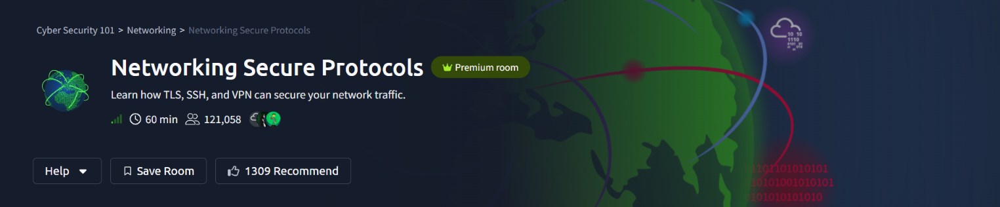
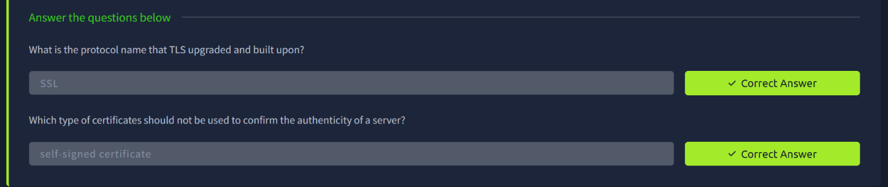
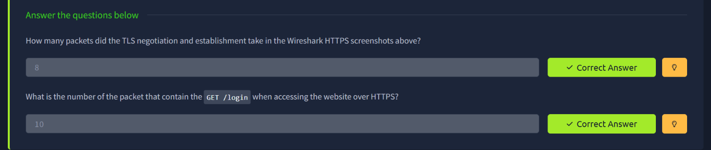
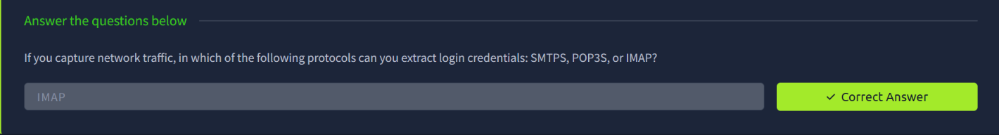
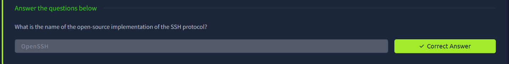
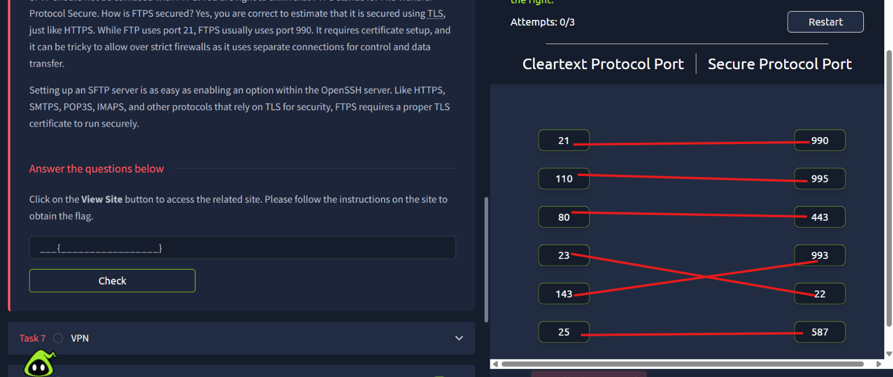
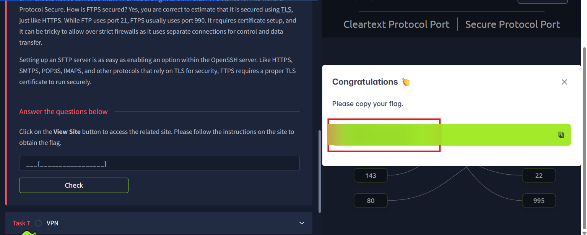
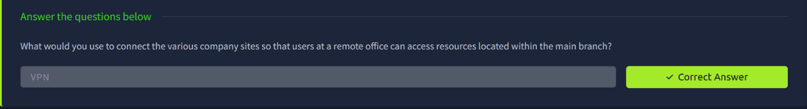
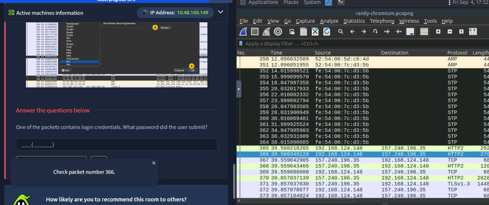
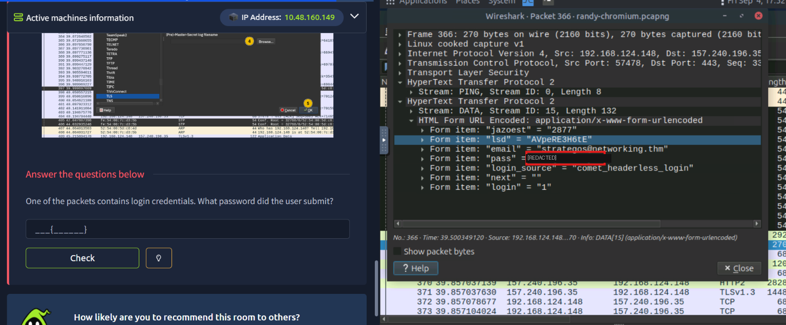

# TryHackMe — Networking Secure Protocols

## Room Info

| | |
|---|---|
| **Room** | [Networking Secure Protocols](https://tryhackme.com/room/networkingsecureprotocols) |
| **Path** | Cyber Security 101 → Networking → Networking Secure Protocols |
| **Difficulty** | Info / Beginner |
| **Time** | ~60 min |
| **Category** | Secure Communications |

## Room Description

This room covers how TLS, SSH, and VPNs secure network traffic that would otherwise travel in plaintext — how encryption gets negotiated, why certificate trust matters, how secure protocol variants (HTTPS, FTPS, SMTPS, etc.) map to their cleartext counterparts, and hands-on packet analysis in Wireshark to see the difference credential exposure makes.

---

## Task — TLS: Encrypting the Web

TLS (Transport Layer Security) is the modern successor to the older SSL protocol, and is what actually secures HTTPS traffic today (SSL itself is deprecated). Certificate trust is central to TLS — a client needs a way to verify it's really talking to the server it thinks it is.

**Q: What is the protocol name that TLS upgraded and built upon?**
`SSL`

**Q: Which type of certificates should not be used to confirm the authenticity of a server?**
`self-signed certificate`

---

## Task — HTTPS: Watching TLS in Wireshark

Capturing an HTTPS session in Wireshark shows the TLS handshake (negotiation) happening before any encrypted application data is exchanged — unlike plain HTTP, where the request itself is visible immediately in cleartext.

**Approach:** Opened the provided `.pcapng` capture in Wireshark and walked through the packet sequence to identify where the TLS handshake ends and encrypted application data (the actual HTTP request) begins.

**Q: How many packets did the TLS negotiation and establishment take in the Wireshark HTTPS screenshots above?**
`8`

**Q: What is the number of the packet that contains the `GET /login` when accessing the website over HTTPS?**
`10`

---

## Task — Email Protocols, Secured

Just as HTTP has HTTPS, the classic mail protocols have TLS-secured counterparts: **SMTPS**, **POP3S**, and **IMAPS**. Without TLS, credentials sent over any of these travel in plaintext and are trivially recoverable from a packet capture.

**Q: If you capture network traffic, in which of the following protocols can you extract login credentials: SMTPS, POP3S, or IMAP?**
`IMAP` — the one still lacking the "S" (secured) variant in this comparison is the one sending credentials in the clear.

---

## Task — SSH: Secure Remote Access

SSH replaces old, insecure remote-access protocols like Telnet with an encrypted channel for command execution, file transfer, and tunneling. The dominant open-source implementation is maintained by the OpenBSD project.

**Q: What is the name of the open-source implementation of the SSH protocol?**
`OpenSSH`

---

## Task — FTPS & Secure Protocol Ports

Secure protocol variants generally run on dedicated ports separate from their cleartext counterparts. This task matched each cleartext protocol port to its corresponding TLS-secured port.

**Cleartext → Secure port mapping:**

| Protocol | Cleartext Port | Secure Port |
|---|---|---|
| FTP → FTPS | 21 | 990 |
| POP3 → POP3S | 110 | 995 |
| HTTP → HTTPS | 80 | 443 |
| Telnet → (secure equivalent) | 23 | 992 |
| IMAP → IMAPS | 143 | 993 |
| SMTP → SMTPS (submission) | 25 | 587 |

Completing the port-matching challenge on the linked site unlocked the flag.

> 🚩 Flag value redacted — complete the port-matching challenge yourself on the linked site to retrieve it.

---

## Task — VPN: Securing Site-to-Site Connectivity

A VPN (Virtual Private Network) creates an encrypted tunnel between two endpoints, letting geographically separate sites (e.g. a remote office and a main branch) communicate over the public internet as if they were on the same private network.

**Q: What would you use to connect the various company sites so that users at a remote office can access resources located within the main branch?**
`VPN`

---

## Task — Practical: Recovering Credentials from a Packet Capture

The final practical task involved analyzing a real browser traffic capture (`randy-chromium.pcapng`) to find a login submission. To decrypt the TLS traffic, Wireshark was configured with the session's **(Pre)-Master-Secret log filename**, allowing the encrypted HTTPS stream to be viewed in plaintext.

**Approach:**
1. Loaded the `(Pre)-Master-Secret` log file into Wireshark's TLS protocol preferences to enable decryption
2. Filtered/located the `HTTP2 DATA` stream carrying the login form submission (packet 366)
3. Followed the decrypted HTTP2 stream and inspected the URL-encoded form data

Once decrypted, the form submission revealed the full login POST body — including the `email` field and the submitted `pass` field.

**Q: One of the packets contains login credentials. What password did the user submit?**

> 🚩 Password value redacted — decrypt the capture with the provided master-secret log and inspect packet 366 yourself to retrieve it.

---

## Summary

| Task | Protocol / Concept | Key Skill |
|---|---|---|
| TLS | Transport Layer Security | SSL → TLS evolution, certificate trust |
| HTTPS | TLS in practice | Reading a Wireshark handshake vs. encrypted app data |
| Email security | SMTPS / POP3S / IMAPS | Identifying which variant lacks TLS protection |
| SSH | Secure remote access | OpenSSH as the standard implementation |
| FTPS & ports | Secure protocol variants | Mapping cleartext ports to their TLS-secured equivalents |
| VPN | Site-to-site connectivity | Encrypted tunnels across public networks |
| Practical | TLS decryption in Wireshark | Using a master-secret log to decrypt and recover POSTed credentials |

**Key takeaway:** This room made the "why" behind TLS very concrete — the final practical task showed exactly what an attacker could pull from a packet capture on plaintext or improperly secured traffic (a full login form, credentials included), reinforcing why HTTPS, POP3S/IMAPS, and SSH exist in the first place. Being able to decrypt TLS with a master-secret log is also a genuinely useful skill for legitimate traffic analysis and debugging.

---
*Part of my [Cyber Security 101](https://tryhackme.com/path/outline/cybersecurity101) TryHackMe learning path.*
